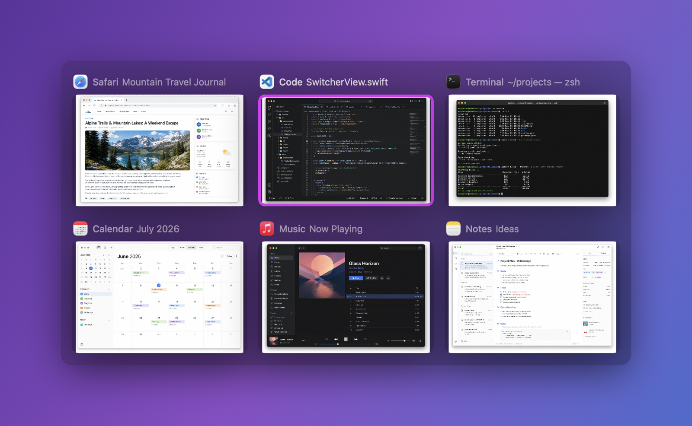

# cTab

Command+Tab で、開いている全アプリケーションの**ウィンドウ単位**の切り替えを行う macOS アプリです。macOS 標準の Command+Tab（アプリ単位）を置き換え、 ウィンドウのサムネイル一覧から切り替えられます。

詳細な仕様は [docs/specification_ja.md](docs/specification_ja.md)（English: [docs/specification_en.md](docs/specification_en.md)）を参照してください。



> スクリーンショットのウィンドウ内容は、実際の画面を写さないよう AI で生成した架空のアプリ画面です。UI レイアウトは実際の `SwitcherView` をそのまま描画しています。

## 特徴

- **ウィンドウ単位の切り替え** — アプリ単位ではなく、個々のウィンドウを一覧表示
- **画面内に収まるグリッド表示** — ウィンドウ数に応じて列数・サムネイルサイズを自動調整し、横スクロールせず画面内に収める
- **Command+Tab を横取り** — CGEventTap で標準スイッチャーを抑制し、独自のスイッチャーを表示
- **カスタムショートカット** — トリガの修飾キー（Command/Option/Control）とキー（Tab / `）を設定で変更可能。Command 以外にすれば標準の Command+Tab を残せる
- **逆順移動** — `Command+Shift+Tab` で逆方向に選択
- **方向キーで選択** — `Command` を押したまま矢印キー（←→↑↓）でグリッド上を移動
- **インクリメンタル検索** — スイッチャー表示中に文字を入力するとアプリ名 / ウィンドウ名で絞り込み（`Backspace` で削除）。トグルモードと相性が良い
- **ウィンドウ操作** — スイッチャー表示中、選択中のウィンドウに対して `Command+W`（閉じる）/ `Command+Q`（アプリ終了）/ `Command+M`（最小化）/ `Command+F`（フルスクリーン切替）
- **マウス操作** — セルをクリックでそのウィンドウへ切り替え。セルにマウスホバーで閉じるボタン（×）を表示し、クリックでそのウィンドウを閉じる（`Command` を押したまま操作）
- **ホールド/トグルモード** — 設定で選択。ホールド＝修飾キーを離して確定（標準と同じ）、トグル＝開いたまま `Return` で確定・`Escape` でキャンセル（マウスや矢印でゆっくり選べる）
- **キャンセル** — スイッチャー表示中に `Escape`
- **サムネイル表示（キャッシュ付き）** — ScreenCaptureKit でウィンドウのプレビューを取得。windowID ごとにメモリキャッシュし、スイッチャーを開いた瞬間に前回分を即表示して裏で最新化（取得前・権限なしはアプリアイコンで代替。連続バックグラウンド撮影はしないため、画面収録インジケータの常時表示や電池消費はない）
- **最小化ウィンドウの復元** — 最小化中のウィンドウを選ぶと復元して前面化
- **別 Space のウィンドウ** — 別 Space にあるウィンドウも一覧に含める（設定でON/OFF）。選ぶとその Space へ切り替わる
- **ログイン時に自動起動** — 設定ウィンドウから ON/OFF（`SMAppService` によるログイン項目登録）
- **ディスプレイに応じた表示サイズ** — 表示先（最前面ウィンドウのある画面）の解像度に合わせて自動拡大。設定画面のスライダーで倍率も調整できる
- **全ディスプレイ同時表示（任意）** — 設定でONにすると全ディスプレイに同時表示（各画面の解像度に合わせてサイズ調整、選択状態は同期）。キーボード操作は全画面、マウス操作はマウスカーソルのある画面で可能
- **アクティブディスプレイの識別** — 複数ディスプレイ環境で、各ウィンドウがマウスカーソルのある画面にあるかどうかを判別。アクティブ画面にあるウィンドウは通常表示、他の画面にあるウィンドウは**背景を黒く**して見分けやすくする（マウス移動にリアルタイム追従）。設定でON/OFFと黒さを調整可能
- **設定ウィンドウ** — アプリ起動時に表示。ショートカット・起動方式、権限状態の確認、ログイン起動の切替、表示サイズ・全ディスプレイ・別Space・アクティブディスプレイ強調、テーマ/外観、使い方、**再起動**・終了ができる
- **テーマ / 外観** — 外観（システム/ライト/ダーク）、選択枠のアクセントカラー、パネル背景の不透明度を設定で変更可能
- **メニューバー常駐** — Dock にアイコンを出さないアクセサリアプリ（`⌘⇥` メニュー：設定を開く / 再起動 / 終了）

## 必要環境

- macOS 14 以降（開発・検証は macOS 26）
- Swift 6 ツールチェーン（Xcode 26 同梱）

## インストール

### Homebrew から（推奨）

```bash
brew install --cask --no-quarantine petitviolet/tap/ctab
```

`--no-quarantine` は Gatekeeper の隔離を付けないためのオプションです（cTab は ad-hoc 署名・未公証のため、これを付けないと初回起動時に隔離解除の操作が必要になります）。更新は `brew upgrade --cask ctab`。インストール後は [権限の付与](#権限の付与) に従ってください。

### GitHub Releases から

ビルド済みの `.app` を [Releases](https://github.com/petitviolet/cTab/releases) からダウンロードできます（`v*` タグの push ごとに自動ビルド・公開されます）。

1. 最新リリースの `cTab-vX.Y.Z.zip` をダウンロードして展開
2. `cTab.app` を `~/Applications`（または `/Applications`）へ移動
3. 配布ビルドは Apple の公証（notarization）を受けていないため、初回は Gatekeeper に隔離されます。次のいずれかで解除してから起動してください。
   - Finder で `cTab.app` を右クリック →「開く」→ ダイアログで「開く」
   - もしくはターミナルで隔離属性を除去：
     ```bash
     xattr -dr com.apple.quarantine ~/Applications/cTab.app
     ```
4. 起動後、[権限の付与](#権限の付与) に従ってアクセシビリティ（必須）と画面収録（任意）を許可

> 配布ビルドは ad-hoc 署名のため、[再ビルド後も権限を維持する](#再ビルド後も権限を維持する推奨) 仕組みは効きません（macOS の更新やアプリ差し替えで権限の再付与が必要になることがあります）。権限を永続化したい場合はソースからビルドし、自己署名証明書を使う方法を推奨します。

### ソースからビルド

```bash
# ユニットテスト
swift test

# .app をビルド・署名して ~/Applications にインストールし起動
scripts/build_app.sh run
```

サブコマンド: `build` / `icon`（アイコン `.icns` を生成）/ `cert`（権限永続化用の署名証明書を作成）/ `bundle`（`build/cTab.app` を生成）/ `install`（`~/Applications` へ配置）/ `run`（インストールして起動）/ `reset`（権限リセット）/ `uninstall`（削除して権限リボーク）。

### アプリアイコン

アイコンは `scripts/generate_icon.swift`（Swift + CoreGraphics、外部依存なし）で描画し、`iconutil` で `Resources/cTab.icns` を生成します。デザインはグラデーション背景に重なったウィンドウカードと ⌘ グリフで、ウィンドウ切替を表現しています。再生成は次のコマンド。

```bash
scripts/build_app.sh icon
```

## 権限の付与

cTab は次の 2 つの権限を必要とします。初回起動時にシステムダイアログが出ます。

1. **アクセシビリティ（必須）** — Command+Tab の傍受とウィンドウ操作に必要
   システム設定 > プライバシーとセキュリティ > アクセシビリティ で `cTab` を ON
2. **画面収録（任意）** — ウィンドウサムネイルの取得に必要。未許可でもアイコン表示で動作
   システム設定 > プライバシーとセキュリティ > 画面収録 で `cTab` を ON

権限の付与・確認や再起動は、アプリ起動時に表示される**設定ウィンドウ**から行えます（メニューバーの `⌘⇥` →「設定を開く」でも開けます）。権限を付与したら設定ウィンドウの「再起動」ボタンで再起動すると反映されます。

### 再ビルド後も権限を維持する（推奨）

ad-hoc 署名（`codesign -s -`）は実行ファイルの **cdhash** に紐づくため、再ビルドのたびに macOS が「別アプリ」と判定し、付与済みの TCC 権限（アクセシビリティ・画面収録）が**失効**します。

固定の**自己署名コード署名証明書**で署名すると、Designated Requirement が「bundle id + 証明書」基準になり、再ビルドしても権限が維持されます。Apple Developer Program は不要です。

```bash
# 1) 一度だけ：自己署名証明書を作成（専用キーチェーンを使うのでパスワード入力は不要）
scripts/build_app.sh cert

# 2) 再インストール（以後は自動でこの証明書で署名されます）
scripts/build_app.sh run

# 3) 権限を一度だけ付与（設定ウィンドウ or システム設定）。以後の再ビルドでは維持されます。
```

- 証明書は専用キーチェーン `~/Library/Keychains/cTab-signing.keychain-db` に作成し、信頼ストアには登録しません（ローカル署名専用）。`security find-identity -p codesigning` で `cTab Self-Signed` を確認できます。
- この専用キーチェーンのパスワードはスクリプトに固定値で書かれていますが、**信頼されないローカル自己署名証明書専用のため秘匿性はありません**（他者がこの値を知ってもユーザーの環境には影響しません）。
- ad-hoc から証明書署名へ切り替えた**直後の初回のみ**、DR が変わるため権限の再付与が必要です。それ以降は維持されます。
- 別の名前の既存証明書を使う場合は `CODESIGN_IDENTITY="証明書名" scripts/build_app.sh run`。
- 証明書を削除すると DR が変わるため、再付与が必要になります。専用キーチェーンごと消すには `security delete-keychain ~/Library/Keychains/cTab-signing.keychain-db`。

証明書を使わない場合（ad-hoc のまま）、再ビルドで権限が切れたら次でリセットして再付与します。

```bash
scripts/build_app.sh reset   # tccutil reset Accessibility/ScreenCapture
```

## 使い方

1. `Command` を押したまま `Tab` を叩くとスイッチャーが開き、次のウィンドウへ選択が移動
2. `Command` を押したまま、`Tab`（`Shift` で逆順）または矢印キー（←→↑↓）で選択を移動
3. `Command` を押したまま `Command+W` で選択ウィンドウを閉じる、`Command+Q` で選択アプリを終了（一覧から消えてそのまま継続）
4. `Command` を離すと選択中のウィンドウが前面化
5. `Escape` でキャンセル

> `Command+Q` は graceful 終了のため、未保存ドキュメントがあるアプリでは確認ダイアログが表示されます。スイッチャーは非アクティブパネルのため、ダイアログが背面に出ることがあります（対象アプリを前面化して応答してください）。

### ログイン時の自動起動

メニューバーの `⌘⇥` メニューから「ログイン時に起動」を選ぶと、次回ログインから自動起動します（再選択で解除）。`SMAppService` を使うため、`~/Applications/cTab.app` などインストール済みの `.app` から起動している必要があります（`.build` 直下のバイナリ直接実行では登録できません）。初回登録後、システム設定 > 一般 > ログイン項目 に `cTab` が現れます。

## アーキテクチャ

```
Sources/cTab/
├── main.swift                 エントリ（accessory アプリ起動）
├── App/
│   ├── AppDelegate.swift      権限確認・メニューバー・設定ウィンドウ・配線
│   ├── SettingsWindowController.swift  設定ウィンドウ（NSWindow）の生成・表示
│   ├── SettingsModel.swift    設定画面の状態（権限/ログイン起動/バージョン）
│   ├── LoginItem.swift        ログイン項目（SMAppService）
│   └── Relauncher.swift       アプリ再起動
├── Permissions/Permissions.swift   Accessibility / Screen Recording 権限
├── HotKey/
│   ├── HotKeyMatcher.swift    Command+Tab 判定（純ロジック・テスト対象）
│   └── EventTapController.swift   CGEventTap 生成・イベント傍受/復帰
├── Windows/
│   ├── WindowInfo.swift       ウィンドウモデル
│   ├── WindowEnumerator.swift AX によるウィンドウ列挙（+ 非公開 API で CGWindowID 取得）
│   ├── WindowActivator.swift  AX 前面化 + アプリ activate
│   ├── ThumbnailCapturer.swift   ScreenCaptureKit でサムネイル取得
│   └── ThumbnailCache.swift   windowID ごとのサムネイルのメモリキャッシュ
├── UI/
│   ├── SwitcherViewModel.swift   @Observable 状態（グリッド情報含む）
│   ├── SwitcherView.swift     SwiftUI グリッド（LazyVGrid）
│   ├── SwitcherPanel.swift    NSPanel（nonactivating）
│   ├── SwitcherController.swift  オーケストレーター
│   └── SettingsView.swift     設定ウィンドウの SwiftUI 内容
└── Core/
    ├── Navigation.swift       選択巡回・グリッド移動ロジック（純ロジック・テスト対象）
    ├── GridLayout.swift       画面内に収まる列数・セルサイズの算出（純ロジック・テスト対象）
    └── Log.swift              os.Logger
```

データフロー: `Command+Tab` → EventTap が傍受しイベント消費 → AX でウィンドウ列挙 → NSPanel 表示 → `Tab`/`Shift+Tab` で選択移動 → `Command` 解放を flagsChanged で検知 → AX で前面化。

## セキュリティ / プライバシー

- EventTap の監視対象は keyDown / flagsChanged に限定し、**Command+Tab・Escape 以外のキーは内容を読まず素通し**します（キーロガー化の回避）。
- ウィンドウタイトルや画面サムネイルは**ローカル・メモリ内のみ**で扱い、ディスク保存・ネットワーク送信は一切行いません。
- ログにウィンドウタイトル等の機微情報は出力しません（件数・状態のみ）。

## 既知の制約・今後の拡張

- 別 Space や一部アプリのウィンドウは AX の挙動により取得できないことがあります。
- AX ウィンドウと CGWindowID の対応付けに**非公開 API `_AXUIElementGetWindow`** を使用しています。将来の macOS で挙動が変わる可能性があり、取得失敗時はそのウィンドウをスキップします。
- カスタムショートカット設定（トリガキーの変更）、ウィンドウ除外フィルタは未実装（将来拡張）。
- 配布（他者への共有）には Developer ID 署名 + notarization が別途必要です。自己署名は手元での権限永続化のためのもので、Gatekeeper を通すものではありません。

## ライセンス

[MIT License](LICENSE) のもとで公開しています。Copyright (c) 2026 petitviolet。
